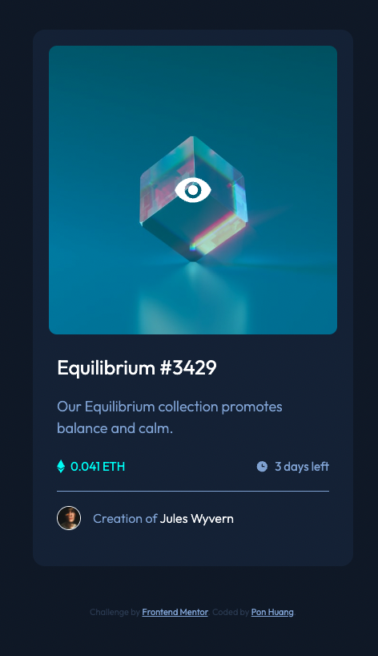

# Frontend Mentor - NFT preview card component solution

This is a solution to the [NFT preview card component challenge on Frontend Mentor](https://www.frontendmentor.io/challenges/nft-preview-card-component-SbdUL_w0U). Frontend Mentor challenges help you improve your coding skills by building realistic projects.

## Table of contents

- [Overview](#overview)
  - [The challenge](#the-challenge)
  - [Screenshot](#screenshot)
  - [Links](#links)
- [My process](#my-process)
  - [Built with](#built-with)
  - [What I learned](#what-i-learned)
  - [Continued development](#continued-development)
  - [Useful resources](#useful-resources)
- [Author](#author)
- [Acknowledgments](#acknowledgments)

**Note: Delete this note and update the table of contents based on what sections you keep.**

## Overview

### The challenge

Users should be able to:

- View the optimal layout depending on their device's screen size
- See hover states for interactive elements

### Screenshot

#### Complete Design


#### Hovering effects

Image


Item Title


Author Link


### Links

- Solution URL: [Add solution URL here](https://github.com/ponhuang/NFT-preview-card)
- Live Site URL: [Add live site URL here](https://ponhuang.github.io/NFT-preview-card/)

## My process

### Built with

- Semantic HTML5 markup
- CSS custom properties
- Flexbox
- Mobile-first workflow

### What I learned

Learned how to overlay icon and color on the image.

```css
.overlay {
  position: absolute;
  top: 0;
  left: 0;
  width: 37rem;
  height: 37rem;
  background: var(--cyan);
  opacity: 0.3;
  visibility: hidden;
}

.view-icon {
  width: 5rem;
  position: absolute;
  top: 50%;
  left: 50%;
  transform: translate(-50%, -50%);
  z-index: 10;
  visibility: hidden;
}

.image-container:hover .overlay,
.image-container:hover .view-icon {
  visibility: visible;
}
```

### Useful resources

- [Image Overlay Icon](https://www.w3schools.com/howto/howto_css_image_overlay_icon.asp) - This helped me knowing how to use overlay class and also work on the color as well.

## Author

Pon Huang

- Instagram - [Pon Huang](https://www.instagram.com/ponhuang/)
- Art Blog - [une felt](https://une722.wordpress.com)
